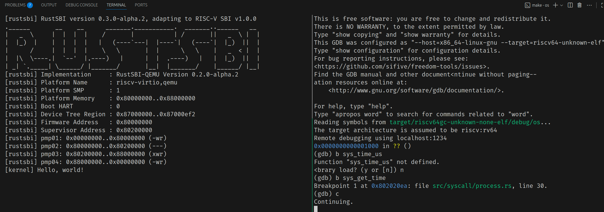

# 试验三报告

## 试验过程

均为自己手写代码，参考一点GPT-5mini模型的一些建议

## 遇到的问题

`BASE=0`和`BASE=1`都没有问题，输出结果应该是这样的对吧。

```bash
(base) os> make run BASE=1
(rustup target list | grep "riscv64gc-unknown-none-elf (installed)") || rustup target add riscv64gc-unknown-none-elf
riscv64gc-unknown-none-elf (installed)
cargo install cargo-binutils
    Updating crates.io index
     Ignored package `cargo-binutils v0.4.0` is already installed, use --force to override
rustup component add rust-src
info: component 'rust-src' is up to date
...
power_7 [160000/160000]
7^160000 = 667897727(MOD 998244353)
Test power_7 OK!
AAAAAAAAAA [1/5]
BBBBBBBBBB [1/5]
CCCCCCCCCC [1/5]
AAAAAAAAAA [2/5]
BBBBBBBBBB [2/5]
CCCCCCCCCC [2/5]
AAAAAAAAAA [3/5]
BBBBBBBBBB [3/5]
CCCCCCCCCC [3/5]
BBBBBBBBBB [4/5]
CCCCCCCCCC [4/5]
AAAAAAAAAA [4/5]
BBBBBBBBBB [5/5]
CCCCCCCCCC [5/5]
AAAAAAAAAA [5/5]
Test write B OK!
Test write C OK!
Test write A OK!
[kernel] Panicked at src/task/mod.rs:136 All applications completed!
```

```bash
(base) os> make run BASE=0
(rustup target list | grep "riscv64gc-unknown-none-elf (installed)") || rustup target add riscv64gc-unknown-none-elf
riscv64gc-unknown-none-elf (installed)
cargo install cargo-binutils
    Updating crates.io index
...
[rustsbi] pmp04: 0x88000000..0x00000000 (-wr)
[kernel] Hello, world!
get_time OK! 5
current time_msec = 6
time_msec = 106 after sleeping 100 ticks, delta = 100ms!
Test sleep1 passed!
string from task trace test

Test trace OK!
Test sleep OK!
[kernel] Panicked at src/task/mod.rs:136 All applications completed!
```

但是`BASE=2`就会出错
```bash
(base) os> make run BASE=2
(rustup target list | grep "riscv64gc-unknown-none-elf (installed)") || rustup target add riscv64gc-unknown-none-elf
riscv64gc-unknown-none-elf (installed)
cargo install cargo-binutils
    Updating crates.io index
     Ignored package `cargo-binutils v0.4.0` is already installed, use --force to override
...
power_7 [160000/160000]
7^160000 = 667897727(MOD 998244353)
Test power_7 OK!
Panicked at src/bin/ch3_sleep.rs:16, assertion failed: current_time > 0
current time_msec = 0
BBBBBBBBBB [1/5]
CCCCCCCCCC [1/5]
AAAAAAAAAA [1/5]
BBBBBBBBBB [2/5]
CCCCCCCCCC [2/5]
AAAAAAAAAA [2/5]
BBBBBBBBBB [3/5]
CCCCCCCCCC [3/5]
AAAAAAAAAA [3/5]
BBBBBBBBBB [4/5]
CCCCCCCCCC [4/5]
AAAAAAAAAA [4/5]
BBBBBBBBBB [5/5]
CCCCCCCCCC [5/5]
AAAAAAAAAA [5/5]
Test write B OK!
Test write C OK!
Test write A OK!
QEMU: Terminated
```

